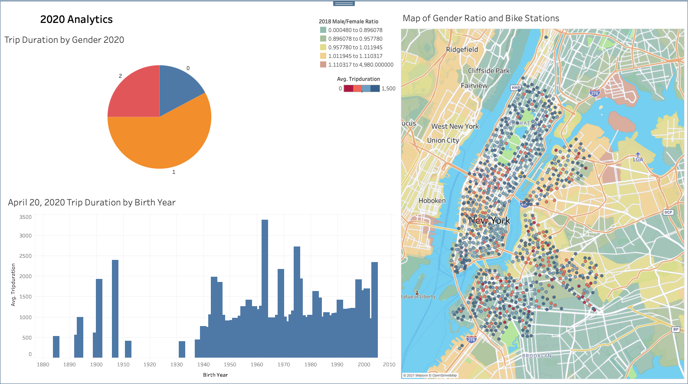
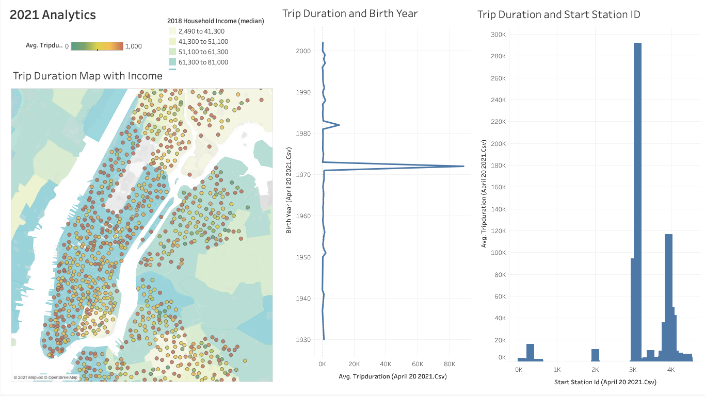

# Tableau_CitiBike_Analysis

During my analysis of CitiBike data from two different dates the following phenomena was found. The dates chosen were April 20, 2020 and April 20, 2021 to compare ridership during the COVID-19 pandemic and when restrictions were starting to relax in 2021.

[Link to Tableau Dashboard](https://public.tableau.com/profile/katie.hartmann#!/vizhome/CitiBike_Analysis_16207788183610/Story1)

In 2020, there was a group of people born in 1963 that had a higher average ridership than any other birth year as well as more male ridership compared to other genders. When looking at this average trip duration on a map by station id there wasn't a clear correlation between trip duration and the male to female ratio based on the 2018 census information.

In 2021, those who were born in 1972 had a higher average trip duration compared to any other birth year. Also, the station ID and trip duration was analyzed and there was one station that had a greater average trip duration than any other station in the area. This station was located outside of Manhattan on Long Island. When mapping the station ID, with average trip duration, there was not a clear correlation between trips and median Household income.

